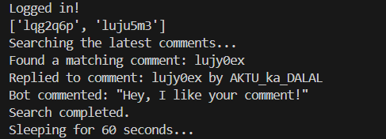

# 🌟 Reddit Comment Bot

A simple Reddit bot that automatically replies to comments containing specific search terms. Built with the **PRAW** (Python Reddit API Wrapper) library, this bot is easy to configure and run.

---

## 📋 Features

- **Automatic Commenting**: Finds and replies to comments with specified keywords.
- **Persistent Tracking**: Avoids duplicate replies by keeping a log of already responded comments.
- **Configurable Settings**: Easily adjust subreddit and search terms.

---

## 🚀 Getting Started

### Prerequisites

- **Python 3.x**
- **PRAW library**: Install it via pip:

```bash
pip install praw
```

### Configuration

1. **Create a Reddit App**:
   - Visit the [Reddit App Preferences](https://www.reddit.com/prefs/apps).
   - Create a new application (choose the script type).
   - Take note of your **client_id**, **client_secret**, **username**, and **password**.

2. **Set Up Configuration**:
   - Create a `config.py` file in the same directory as your bot code with the following content:

```python
username = 'your_reddit_username'
password = 'your_reddit_password'
client_id = 'your_client_id'
client_secret = 'your_client_secret'
```

---

## ⚙️ Usage

1. **Edit the Bot Code**:
   - Modify the `SUBREDDIT_NAME` and `SEARCH_TERMS` variables in the bot code to your desired subreddit and comment search terms.

```python
SUBREDDIT_NAME = 'Sample subreddit'
SEARCH_TERMS = "Sample comment"
```

2. **Run the Bot**:
   - Execute the script:

```bash
python reddit_comment_bot.py
```

---

## 🔍 How It Works

- The bot logs in to Reddit and searches the specified subreddit for comments.
- If a comment contains the specified search term and hasn't been replied to yet, the bot replies with a friendly message.
- The bot waits for a configured amount of time before repeating the process, ensuring it doesn’t hit the Reddit API too frequently.

---

## 📤 Terminal Output on Success

When the script runs successfully, you’ll see a terminal output like this:



## 📂 Code Structure

- **`reddit_comment_bot.py`**: The main bot script that handles login, comment searching, and replying.
- **`config.py`**: Stores sensitive information (Reddit credentials).

---

## 🤝 Contributing

Feel free to fork the repository and submit pull requests for any improvements or additional features!

---

## 🙏 Acknowledgments

- [PRAW Documentation](https://praw.readthedocs.io/en/latest/) - For the PRAW library.
- [Reddit API](https://www.reddit.com/dev/api) - For providing the API for bot interactions.
- Special thanks to [@yashar1](https://github.com/yashar1) for inspiring this project with a similar Reddit bot implementation.
